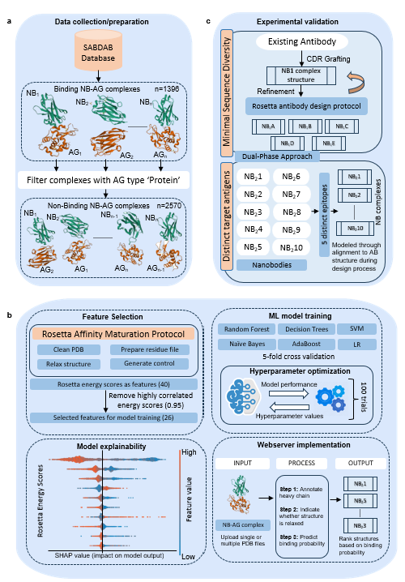

# NanoBinder 

NanoBinder is an interpretablemachine learning model that predicts nanobody-antigen binding using Rosetta energy scores. NanoBinder utilizes a Random Forest model trained on experimentally validated complexes and can be seamlessly integrated into the Rosetta software. It employs SHAP summary plots for interpretability, which helps identify key features influencing binding interactions. Experimentally validated on seventeen diverse nanobodies, NanoBinder accurately predicts non-binders and shows reasonable performance in identifying binders.

